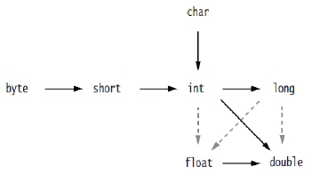
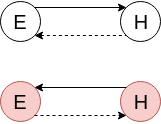

## Where Java store data during program execution?

- stack - links to objects;

- heap - objects;

- ROM - string constants and literals;

## Primitive types

### Overflow

`overflow` will be `-2147483645`.

```
int overflow = Integer.MAX_VALUE + 1;
```

### Casting



On diagram - *Widening Primitive Conversion*.

**Narrowing primitive conversion** - converting an `int` to `char` (and [other](https://docs.oracle.com/javase/specs/jls/se10/html/jls-5.html#jls-5.1.3)).

A narrowing conversion is allowed during the assignments of byte, short and char, if the right-hand side of the assignment is a *constant expression*.

A **constant expression** is (basically) an expression whose result is always the same and can be determined at compile-time.

```
char c = 'A' + 1;
```

## Operators

Prefix (`++i`), postfix (`i++`) and compound operators performs narrowing conversion.

```
char c = 1;
c++; => c = (char)(c + 1);
c += 3.14; => c = (char)(c + 3.14);
```

## Variables

- not initialized by default;

## Methods

- signature - name + arguments;

## Arrays

- when array of objects is creates links are initialized by `null` values;

- when array of primitives is created values are initialized by zeroes;

## Classes

### Fields

- default initialization: `0`, `false`, `null`;

## Objects

### Equals - hashcode contract

- if objects are equals they must have same hash code;
- if hash codes are same objects may not be equal;
- if hash codes of objects are different objects are not equal;
- if objects are not equal they may have same hash codes;



## Wrappers

### Integer

Convert integer to binary form

```
Integer.toBinaryString(10)
```