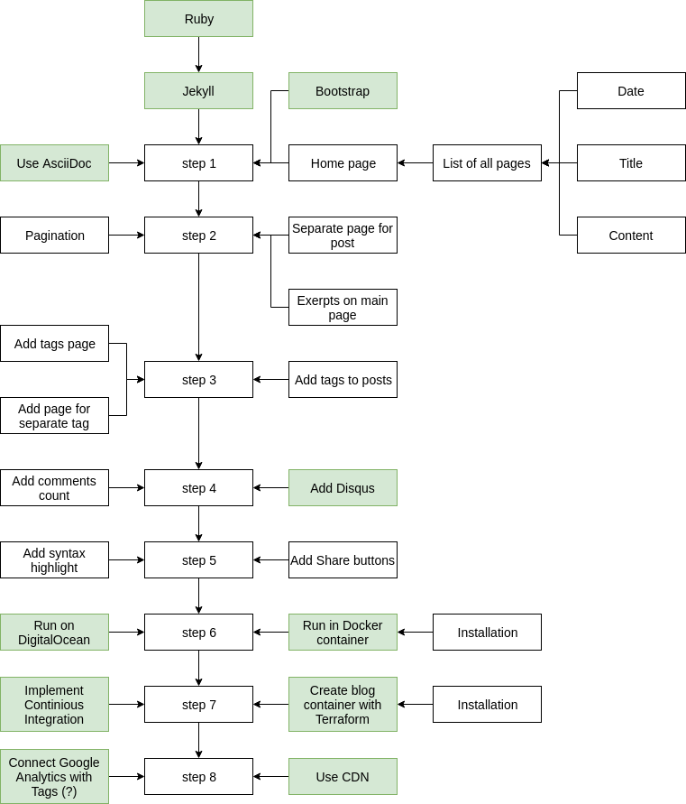

This examples contain step-by-step tutorial, how to create blog with Jekyll.

In tutorial we will cower following topics:

- install Jekyll and create sample blog;
- create basic markup
- use AsciiDoc as template language
- use highlight.js for code blocks highlight
- add comments
- add tags
- add pagination
- add comments
- use Terraform
- add Google Analytics
- create Docker image
- continuous integration

